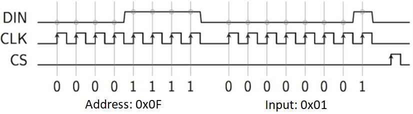

# Embedded Programming: Assembly Code Example
The following code gives some very simple examples of an Assembly Language program. The aim of the examples is to be simple (and short!) enough to be understood easily, while complex enough to be of use. Assembly language code executes faster than even its C counterpart, and is especially of use in embedded programming with FPGAs.

## 1. Probability of Detection from Confusion Matrix
### Problem Description
For classification applications of machine learning, a confusion matrix (CM) is often used to quantify the performance of a model. A confusion matrix, in general, is a matrix of size $M\times M$ where $M$ is the number of classes.
$$CM = \begin{bmatrix}n_{11}&\cdots & n_{1M}\\
\vdots & \ddots & \vdots \\
n_{M1} & \cdots & n_{MM}
\end{bmatrix}$$

where $n_{ij}$ is the number of instances where a datapoint belonging to class $i$ was predicted by the model to be in class $j$. The confusion matrix is therefore always a square matrix, and a model is considered better if it has higher numbers along the diagonals (correct classifications) and lower numbers elsewhere.

The example assembly code aims to calculate the *probability of detection* $PD_m$ given a *confusion matrix* $CM$ for the class $m$. The probability of detection is defined mathematically as:
$$PD_m = \frac{n_{mm}}{\sum_{j=1}^M n_{mj}}$$
Intuitively, it is the probability of classifing class $m$ correctly.

### Code Structure
The code consists of three files:
 - `main.c`: The C program that defines the variables and calls the assembly code as an external function.
 - `pdm.s`: The assembly code which takes as input `CM` the confusion matrix, `M` the total number of classes and `m` the class for which $PD_m$ is calculated.
 - `cr_startup_lpc17.c`: A standard setup file (not written by me) that is used to initialize the program on an FPGA. This one is written for an LCP1769.

### Assembly Code Explanation
The assembly code can be divided into two parts: the main body and the `ELEMENT` subroutine.
 - The `ELEMENT` subroutine is designed to locate the address of $n_{mj}$ and extract the value at the location. To find $n_{mj}$, the formula $[a_{ij}] = [a_{11}] + (4M(i − 1)) + (4(j − 1))$ is used.
 - The main body of the `pdm` function uses a loop to perform the compuation of $\sum_{j=1}^M n_{mj}$ using the `ELEMENT` subroutine, accessing the elements in decreasing values of $j$. This sum is then multiplied by 10000 and then divided by $n_{mm}$. The multiplication by 10000 is done before being passed back to the C program to allow for the preservation of decimal points.

## 2. Fibonacci Sequence
The next example is that of calculating the Fibonacci sequence using assembly language. The code is self explanatory and includes comments to help the reader.

### Code Structure
 - `assembler.py`: Provides an assembler for the assembly language code that can be used by calling `python assembler.py <NAME_OF_ASM_SCRIPT>`. This script in turn loads some important libraries provide in `ese1010.jar`
 - `test.s`: A test script provided to ensure the setup is correct.
 - `fibo.s`: Calculates the $n$th Fibonacci number only
 - `fibotab.s`: Calculates and stores the first $n$ Fibonacci numbers in an array

## 3. Game of Life
This example uses a matrix of 64 LEDs (8x8) to emulate the Game of Life (for more info on the game, look [here](https://en.wikipedia.org/wiki/Conway%27s_Game_of_Life)). To allow for ease of programming, this code is written in Python, but follows the same logical steps.

To allow for precise control of each LED in the array, a multiplexer (MAX7219) is used. The multiplexer allows us to light up a single LED at a time. If done at a high frequency, we can turn on multiple LEDs one at a time, giving the illusion that they are all truned on. Communication with the MAX7219 is done in a serial manner. To write into the register of MAX7219, we need to communicate 2 bytes: the first being the address of the register, and the second being the input related to the LEDs we want to light up. An example is shown in the image below, where CLK is the clock signal and CS is the Chip Select. In this example, we put the MAX7219 in test mode by writing the value 1 in the *Display Test* register (at address 0x0F).

### Code Description:
The file `game_of_life.py` implements this example. Some of the primary functions in this code are:
- `serialWrite(address, data)`: Writes the data value into the register as the given address. This function uses another function `serialShiftByte(data)` to pass the address and data bit by bit, before creating an impulse on the CLK to transmit the bit.
- `matrixIntensity(percent)`: Reglates the intensity of the LEDs as a percentage of the maximum.
- `displayPict(bitmap)`: uses functions `setPixel` and `updateDisplay` to show an image on the LED array. Two pre-defined images are smiley and frowney.

The above functions can be used to implement the game of life, implemented using the functions below:
 - `randomBitmap()`: gives the initial state of the game by randomly setting bits to 1 or 0.
 - `countNeighbours(x,y,bitmap)`: returns the number of neighbours of pixel $(x,y)$ that are alive. Note that the edges of the bitmap are considered to be adjacent and continuous.
 - Several other functions are used to test the game by looking at well known inital blocks of the game of life, such as the stable block, the blinker, the glider and the lightweight spaceship (LWSS).